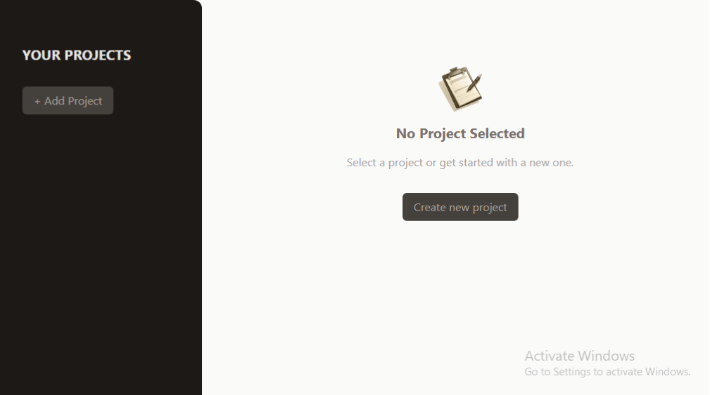

# Project Management App

- Developed a web application for users to manage their projects using React.js.
- Users can:
  - Add a title
  - Add a description
  - Set a due date for the project
- Utilized React Hooks:
  - useState
  - useRef
  - useImperativeHandle
- Created an intuitive and visually appealing front end with Tailwind CSS.

## Live Demo

Check out the live version of the Project Management App:  
🔗 [Project Management](https://projmanagementapp.netlify.app/)

